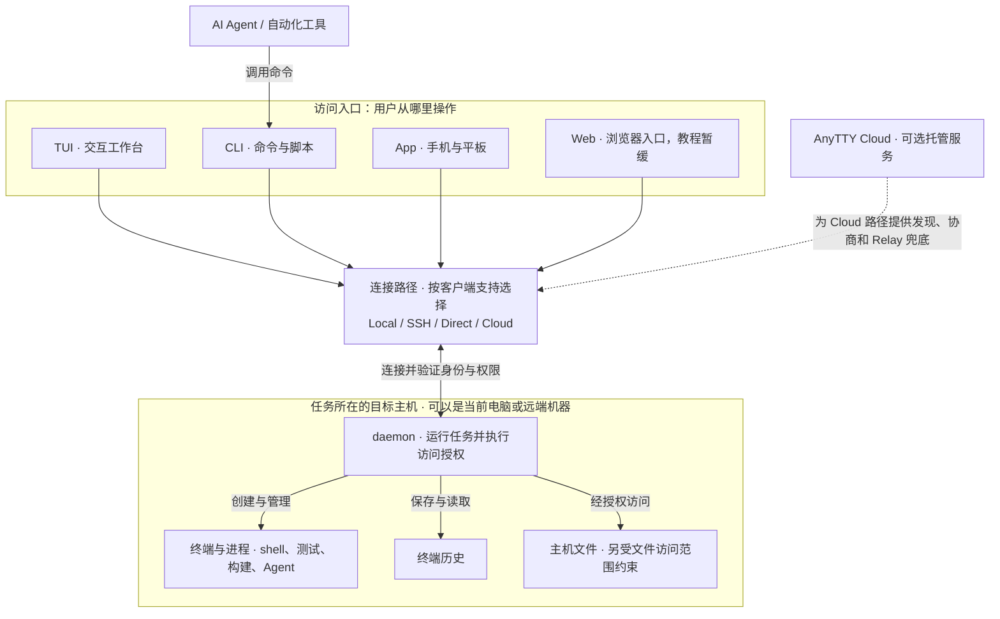
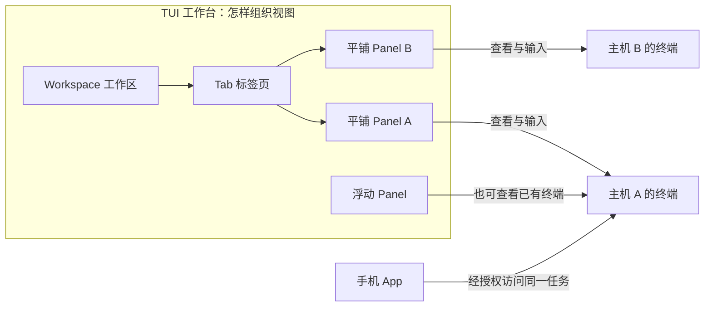
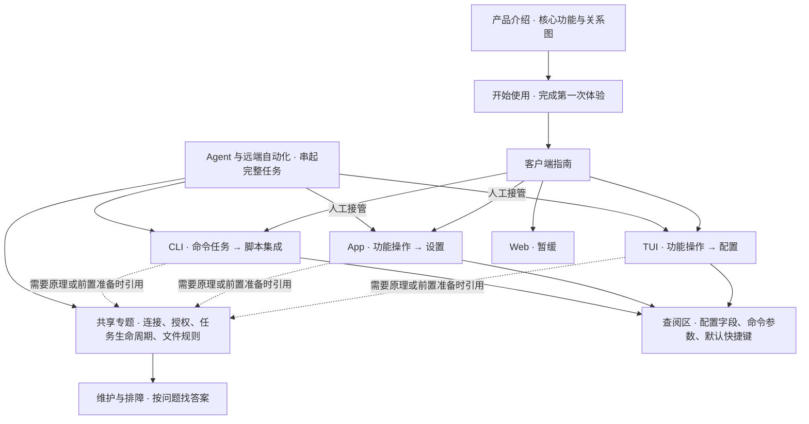

# AnyTTY 正式文档：目录与写作提纲（第二版）

状态：用户已确认结构并授权重写，现已按此落实 61 个主题的中英文正文与分层导航，等待内容审核。Web 使用教程继续暂缓；真实界面截图采用明确占位，关系图已绘制。

## 一、这次怎样组织

文档先回答产品价值，再带用户完成第一次使用；用户随后进入自己正在使用的客户端目录，查功能、学操作、改配置。跨端共用的连接、文件权限和任务生命周期集中说明，Agent 远端操作作为完整工作流单列。

- 新用户默认路径：安装 → 运行 `anytty` → 在 TUI 中创建终端 → 操作与离开 → 再次打开。
- TUI 上手不要求先运行 daemon 管理命令，也不要求先用 CLI 创建终端。daemon 命令放维护与排障；CLI 命令放 CLI 和自动化指南。
- 客户端目录必须分层：客户端 → TUI / App / CLI / Web → 功能文章；TUI 内再有独立配置子目录。
- 每个核心功能都解释用途、适用场景、实际操作、完成结果、相关配置和限制。目录页负责导航，不能代替功能正文。
- 默认按钮和快捷键必须注明所依据的配置；安装推荐配置与无配置文件时的内置默认值分别解释。
- 以下目录是逻辑层级及建议 URL 结构，不受现有 MDX 扁平目录限制。实现导航时再处理旧地址兼容，不提前创建空页面。

## 二、总目录

```text
文档
├─ 认识 AnyTTY
│  ├─ AnyTTY 是什么：核心功能与典型场景
│  ├─ 工作原理：任务、设备与客户端的关系
│  └─ 客户端与能力选择
├─ 开始使用
│  ├─ 安装 AnyTTY
│  ├─ 第一次使用：在 TUI 中完成一个任务
│  └─ 从电脑到手机：第一次跨设备连接
├─ 客户端
│  ├─ TUI
│  │  ├─ 认识工作台与默认操作
│  │  ├─ 创建和管理终端
│  │  ├─ 终端选择器与终端管理器
│  │  ├─ 工作区、标签页与分屏
│  │  ├─ 浮动窗口
│  │  ├─ 历史、选择、复制与粘贴
│  │  ├─ 连接和管理远端设备
│  │  ├─ 多端查看与终端尺寸
│  │  └─ 配置
│  │     ├─ 配置入门与加载规则
│  │     ├─ 主题、颜色与界面外观
│  │     ├─ 快捷键、模式与按键透传
│  │     ├─ 交互、选择器与剪贴板设置
│  │     └─ 完整配置示例与常用方案
│  ├─ App（手机与平板）
│  │  ├─ 安装、添加设备与首次连接
│  │  ├─ 设备与连接管理
│  │  ├─ 终端列表、查看与操作
│  │  ├─ 触控、键盘与花瓣菜单
│  │  ├─ 终端显示、主题与尺寸设置
│  │  ├─ 文件浏览、传输与预览
│  │  └─ 后台、通知、重连与平板使用
│  ├─ CLI
│  │  ├─ 命令入门与目标选择
│  │  ├─ 终端与任务命令
│  │  ├─ 设备、连接与配对命令
│  │  ├─ 文件与历史命令
│  │  └─ 脚本集成：结构化输出、事件与结果
│  └─ Web（暂缓，待产品优化后另拟子目录）
├─ 连接与授权
│  ├─ 选择连接方式：Local / SSH / Direct / Cloud
│  ├─ 通过 SSH 连接远端机器
│  ├─ 通过 Direct 连接局域网设备
│  ├─ 配对、访问范围与撤销授权
│  └─ 多条连接路径、回退与连接诊断
├─ 终端与文件的共享规则
│  ├─ 任务生命周期与持久化边界
│  ├─ 实时画面、历史与多客户端行为
│  ├─ 文件目录、权限与路径
│  └─ 文件传输、预览能力与限制
├─ Agent 与远端自动化
│  ├─ 让 Agent 使用 AnyTTY
│  ├─ 让 Agent 在远端执行一个完整任务
│  ├─ 构建、测试与常驻服务
│  ├─ 多任务组织、观察与人工接管
│  └─ 远端文件、日志与结果交付
├─ AnyTTY Cloud
│  ├─ Cloud 的作用与适用场景
│  ├─ 接入设备、客户端配对与连接检查
│  └─ P2P、Relay 与服务限制
├─ 配置与日常维护
│  ├─ daemon 的自动启动与手动管理
│  ├─ daemon 配置与历史保留
│  ├─ 更新、版本兼容与数据迁移
│  └─ 数据位置、日志、备份与清理
└─ 帮助与参考
   ├─ 按现象查找故障
   ├─ 常见问题
   ├─ CLI 命令与参数参考
   ├─ 配置字段参考
   ├─ 默认快捷键与动作参考
   └─ 安全、版本与支持入口
```

## 产品关系与文档关系：先用图建立理解

### 产品关系图（用户视角）

这张图用于产品介绍和核心概念页，不展示内部包结构。客户端之间是并列关系；终端任务由目标主机运行。图中的连接方式是总体可选路径，不表示每个客户端都支持所有路径。



配套文字必须解释：

- **TUI 与 CLI：** 是同一个 `anytty` 可执行文件提供的不同使用入口。直接 `anytty` 进入 TUI；带子命令执行 CLI 操作。它们不是“TUI 必须先通过 CLI 创建任务”的串行流程。
- **daemon：** 属于任务所在主机，通常由客户端按需启动；手动管理命令用于明确的维护需要。手机和网页不是进程宿主。
- **App 与 Web：** 都是访问入口，但交互、配置、可用路由与功能范围需要分别核实。不能因为底层共享能力，就把一端的所有功能复制到另一端文档。
- **Cloud：** 是可选连接能力，不是所有访问的必经中心，不替用户执行 shell 或保存项目工作目录。图中虚线表示对连接的辅助，具体数据是否经 Relay 取决于实际路径。
- **多台主机：** 每个 endpoint 指向其目标 daemon；每台主机有自己的进程、文件和授权。多机管理不是把所有任务搬到一个中央 daemon。

### TUI 布局与任务关系图

放在 TUI“认识工作台”之后。帮助用户理解“关掉一个视图”和“结束一个任务”的区别。



这张图表达视图与任务的关系，不表示内部存储结构。配套正文说明：切换视图不会迁移进程；独立布局不代表独立任务；修改主题不修改任务启动规格；同一任务的输入与尺寸可能受多个客户端影响。

### 文档组织图



### 各层之间怎样分工

| 层级 | 回答的问题 | 应当包含 | 避免的问题 |
| --- | --- | --- | --- |
| 产品介绍 | 为什么使用 AnyTTY？ | 核心功能、典型场景、关系图、选择入口 | 一开始只解释内部术语和命令 |
| 开始使用 | 怎样完成第一次体验？ | 最短可用路径、实际动作和完成结果 | 先要求学习配置与运维 |
| 客户端功能 | 在我正在使用的界面里怎么做？ | 实际按钮、默认键、流程、截图、适用配置 | 用 CLI 命令代替已有 TUI/App 操作 |
| 客户端配置 | 怎样改成我想要的行为？ | 配置路径、加载/生效、示例和实际效果 | 只贴字段名，不说明作用与继承关系 |
| 共享专题 | 不同入口背后的规则是什么？ | 连接条件、授权、生命周期和能力边界 | 每个客户端复制一套互相矛盾的解释 |
| 场景工作流 | 怎样跨模块完成一件事？ | 完整起点、步骤、结果和失败处理 | 只有链接集合或命令片段 |
| 参考与排障 | 我需要一个精确答案 | 参数、字段、默认值、诊断顺序和教程回链 | 让新用户先读完整参考才能上手 |

共享专题是可深入阅读的依据，不应让用户为了完成第一次操作不停跳转。客户端教程保留执行任务必须知道的步骤，再链接详细解释。

### 正文阶段需要制作的图

| 图 | 放置位置 | 要解决的理解问题 |
| --- | --- | --- |
| 产品组成与连接关系 | 产品介绍、核心概念 | 谁是客户端、谁运行任务、Cloud 在哪里 |
| TUI 界面标注图 | TUI / 认识工作台 | 每个按钮、区域和状态代表什么 |
| 布局与终端对应关系 | TUI / 布局 | workspace、tab、panel 与任务不是一回事 |
| 配置加载与生效图 | TUI / 配置入门 | 默认值、推荐文件、自定义和环境覆盖如何生效，哪些是 UI 配置 |
| 配对与连接时序 | 连接 / 配对 | 谁生成材料、谁兑换、如何获得权限并连接 |
| 跨设备接管流程 | App 首次连接、跨设备教程 | 回到同一个任务需要哪些条件 |
| Agent 远端任务流程 | Agent / 完整远端任务 | 本地调用、远端执行、观察、人工接管、结果交付怎样衔接 |

图不为装饰而添加。每张图必须服务一个具体问题，配有文字解释，并与当前版本的正文、界面和配置保持一致。正文审核时同时审核图，不把它留到最后临时补齐。

## 三、各模块写作提纲

### 1. 认识 AnyTTY

| 文章 | 必须讲清的内容 |
| --- | --- |
| AnyTTY 是什么 | 开篇讲核心功能：任务由主机持续运行；电脑、手机和平板访问同一个任务；本地与远端统一管理；多终端工作台；历史回看；远端文件处理；让 Agent 的工作可观察、可接管。每项配一个实际用途和后续操作入口。解释与普通终端窗口、单纯 SSH 登录的使用关系，不做无依据的竞品比较。 |
| 工作原理 | 用一张简单关系图说明主机/daemon → terminal → 多个客户端；解释布局与任务分开、离开客户端与退出进程分开。先用用户语言，再给必要术语。说明主机断电、daemon 停止和应用恢复边界。 |
| 客户端与能力选择 | 按电脑交互、手机查看、脚本执行等需求选择客户端。给出经过核实的平台和能力矩阵，不能推断每端功能相同。客户端、操作系统和连接方式是三个不同维度。Web 状态待定，不写教程。 |

### 2. 开始使用

| 文章 | 必须讲清的内容 |
| --- | --- |
| 安装 | 各平台安装入口、环境要求、安装位置与完成检查。不要把完整 daemon 运维教程作为安装步骤。区分源码要求与实际发布包要求。 |
| 第一次使用 | 主路径只有安装后运行 `anytty`，再在 TUI 内创建终端、输入一个命令、离开工作台并回来。明确首次空状态与已有任务时的行为；步骤写出实际按钮/菜单/默认键，不用“按提示操作”代替。失败时链接到针对性排障。 |
| 第一次跨设备连接 | 在目标主机已有任务的前提下，选择可达连接、生成配对材料、在 App 添加设备、打开原终端并返回电脑核对结果。详细网络准备链接到连接专题，不让用户靠猜测完成首次配对。 |

### 3. 客户端 / TUI

| 文章 | 必须讲清的内容 |
| --- | --- |
| 认识工作台与默认操作 | 用带标注的当前版本截图识别顶部、tab、panel、底部提示、焦点与状态。解释按钮和键对应同一个动作；列明默认配置下的操作，再链接自定义配置。第一次读完即可辨认目标并完成基本导航。 |
| 创建和管理终端 | 完全使用 TUI 完成创建、选择 shell/启动命令、工作目录、命名、标签编辑、查看状态、重启、停止、删除。核实表单实际字段与入口。每种动作说明对进程和记录的影响，避免把关闭视图等同于结束任务。 |
| 选择器与管理器 | 分别解释何时用 Picker 快速切换、何时用 Manager 检查和管理任务；搜索字段、标签筛选、预览、状态、近期活动与可见的资源信息。演示从十几个终端中找到某个项目任务。 |
| 工作区、标签页与分屏 | 解释层次，再用一个实际项目从空布局建立开发/测试/日志视图。写明创建、切换、聚焦、分屏、缩放、平衡、关闭入口，以及布局保存/恢复的实际规则。 |
| 浮动窗口 | 新建、绑定已有终端、移动、缩放、收起、召回、关闭；说明什么时候比增加一个 tab 更方便。窗口状态与后台任务分别说明。 |
| 历史与剪贴板 | 进入历史、滚动、搜索、选择、复制、系统粘贴、剪贴板历史与返回 Live。核对不同配置下快捷键；说明宿主终端、AnyTTY 和前台应用如何分别处理按键。 |
| 远端设备 | 从 TUI 连接管理界面添加/编辑/启用设备、检查 route、打开远端终端、混合排列本地与远端任务。具体连接材料引用共享连接教程。只给实际存在的 UI 操作路径，必要的外部准备单独说明。 |
| 多端与尺寸 | 解释谁控制终端尺寸、跟随、接管、尺寸锁定，以及手机加入后全屏程序为什么可能改变排版。给出“电脑主用”和“手机接管”两种操作方案；尺寸控制不等于独占输入。 |

#### TUI / 配置（独立子目录）

| 文章 | 必须讲清的内容 |
| --- | --- |
| 配置入门与加载规则 | 各平台文件位置、`config paths`、`--config`、配置层级与支持的环境变量；内置默认值、安装推荐文件、自定义文件的关系。说明 `version`、缺省字段、空值、校验错误、配置生效方式。区分偏好、布局状态、endpoint registry 与 daemon 设置。`profile` 当前不能描述成自动切换/合并多套配置的功能。 |
| 主题、颜色与界面外观 | `theme` 的 host/builtin 基线、明暗模式与颜色覆盖；`chrome` 的标题栏、tab、panel、图标与模板；`footer` 的内容和样式。给出可运行的最小示例、改前改后截图。说明 TUI 外观不等于终端程序 ANSI 配色，字体属于哪个层面。 |
| 快捷键、模式与透传 | 从“换一个常用入口”讲起，说明 action、scene、绑定、文案与样式；短格式和长格式；默认目录继承与替换；Esc 保留规则、前缀超时、双击透传和宿主按键冲突。尤其解释显式 scene 会替换完整默认场景目录，示例必须保留必要入口并能回退。 |
| 交互与选择器设置 | 鼠标、危险动作确认、选择器匹配与高亮、剪贴板历史显示、自动请求尺寸控制。每项说明字段、默认行为、适用场景、取值和效果；配置存在但尚未实现的行为不能写成已生效。 |
| 完整示例与常用方案 | 提供基础最小配置、默认行为说明、完整推荐配置及实用修改方案。示例必须可以校验，逐条标出修改点、恢复方式和是否需要重新打开 TUI。不能把重启 daemon 当作所有 UI 配置的统一应用步骤。 |

### 4. 客户端 / App

| 文章 | 必须讲清的内容 |
| --- | --- |
| 安装与首次连接 | Android 与 iOS 分发、首次权限、添加入口、扫码/粘贴、连接成功的判断。仅描述当前发布版本的界面；桌面侧准备链接到配对专题。 |
| 设备与连接管理 | 设备列表含义、添加/编辑、连接路径管理、重连与移除；区分删除本机设备记录和撤销主机 grant。 |
| 终端查看与操作 | 终端列表、搜索/筛选的实际支持、打开、状态、近期活动和可用的管理动作；说明触控端哪些动作有入口，不能照搬 TUI 能力。 |
| 触控、键盘与花瓣菜单 | 点击、长按、选择、扩展键、修饰键、输入法、粘贴；花瓣菜单的开启、动作编辑、层级与恢复。用一个真实操作任务演示配置前后变化。 |
| 显示与尺寸设置 | App 外观与终端主题的区别；字体、字号、光标、滚动、键盘避让和自动尺寸接管。逐项说明效果，给出手机、外接键盘和平板的使用建议。 |
| 文件与预览 | 从设备或终端工作目录进入、浏览、选择、整理、上传、下载、保存到系统、预览与搜索；具体格式矩阵集中在共享文件文档维护。 |
| 后台与平板 | 前后台、锁屏、网络切换、通知条件和系统限制；区分操作系统分屏与 App 自身布局能力。写清回到前台后的恢复步骤和判断方式。 |

### 5. 客户端 / CLI

| 文章 | 必须讲清的内容 |
| --- | --- |
| 命令入门与目标选择 | 何时用 CLI；命令结构、endpoint、target、稳定 ID、默认目标与显式目标。先完整执行一个本机示例，再替换为远端目标。 |
| 终端与任务命令 | 创建、查看、标签、输入、capture、attach、resize、停止与清理；参数属于本机还是目标主机，shell 解析发生在哪里。 |
| 设备与配对命令 | 列表、添加、导入、检查、单路径测试、默认目标与授权维护。展示连接完成后实际打开一个任务，而不是只给命令索引。 |
| 文件与历史命令 | 本地路径/远端路径方向、覆盖规则、目录操作、上传下载、历史搜索范围与分页。明确当前 `history search` 仅访问本机 daemon，不套用远端 target。 |
| 脚本集成 | JSON 结构示例、target 保存、事件流、超时、CLI 退出码与程序退出码、失败重试与重复输入。这里讲接口用法，完整 Agent 远端工作流放下一模块。 |

### 6. 连接与授权、共享规则

| 专题 | 提纲 |
| --- | --- |
| 连接方式选择 | 按已有 SSH、同一局域网、跨网/NAT 等条件选择路径；说明客户端支持差异、所需准备和成功标准。 |
| SSH 专题 | 目标主机准备、SSH 凭据/主机身份、AnyTTY 服务、配对与 endpoint、连接验证、打开任务和文件；远端目录和权限语义。 |
| Direct 专题 | 监听地址、手机/电脑可达性、防火墙、signaling 与数据路径准备、配对、验证；已运行 daemon 变更监听时的应用方式与任务影响。 |
| 配对与授权 | 谁签发、谁兑换、有效期、访问范围、重新配对、权限收紧、设备丢失与撤销；各客户端入口链接到对应指南。 |
| 多路径与诊断 | endpoint 与 route 的关系、优先级与回退、分别测试路径、状态含义、常见失败判断。认证失败不能由回退绕过。 |
| 任务生命周期 | 创建、持续运行、退出、kill、restart、remove、主机重启等对进程/记录/历史的影响。作为各端教程共享的语义依据。 |
| 实时与历史 | 查看旧内容时任务怎样继续、断线后的同步、屏幕与历史文本的区别、多客户端独立视口与共享输入。 |
| 文件目录与权限 | 目标主机路径、授权目录、终端与文件权限区别、跨平台路径和常见拒绝原因。 |
| 传输与预览 | 上传/下载方向、覆盖、进度、取消、中断后的实际行为与校验；按客户端核对格式、搜索、缩放、大小与平台限制，不能把 Web 的预览能力直接算给原生 App。 |

### 7. Agent 与远端自动化

本模块需要回答“我怎样让自己的 Agent 借助 AnyTTY 操作那台远端机器”，不能停留在 `--json`、`wait` 参数介绍。

| 文章 | 必须讲清的内容 |
| --- | --- |
| 让 Agent 使用 AnyTTY | 前提：Agent 所在环境可运行 CLI，目标 endpoint 已配置且有授权。说明如何提供 skill/工具约定、怎样让 Agent 发现可用 endpoint、哪些工作适合独立 terminal。展示可复用的用户请求与期望交付格式。 |
| 远端执行完整任务 | 贯穿示例：“在已连接的 Linux 工作站运行项目测试，把失败摘要和报告取回来。”依次确认设备、连接和目录，创建远端任务，保存 target，观察输出，处理结果，取回产物，报告。明确命令在哪里执行。 |
| 构建、测试与常驻服务 | 有限任务用 wait + exit_code；服务用日志/事件和应用就绪检查；超时不等于停止；区分 CLI 调用失败、网络失联和程序失败，解释继续观察与重新执行的选择。 |
| 多任务与人工接管 | 多项目/多机器的命名与标签；列表筛选、并行执行、资源观察；终端不自动隔离工作目录；需要输入时由人通过 TUI/App 接管原任务，避免重复启动和重复输入。 |
| 文件与交付 | 上传输入、读取日志、下载测试报告/构建产物；核验目标路径与传输结果；最终交付设备、target、命令、状态、程序退出码、摘要和产物位置；任务与记录如何保留或清理。 |

### 8. Cloud、维护与参考

| 模块 | 提纲与边界 |
| --- | --- |
| Cloud | 为什么需要托管连接、接入与配对的区别、可达性检查、P2P/Relay、公开服务限制。Cloud Web 操作页面待 Web 优化后再规划；价格不重复硬编码。 |
| daemon 管理 | 自动启动是正常使用路径；什么时候才需要 start/status/stop/restart/run/doctor。开机常驻的具体能力按平台核实，不把按需自动启动当成系统开机启动。 |
| daemon 配置 | 历史保留、输出缓冲、资源采样等设置的目的、默认值、取值、容量影响和应用方式；与 TUI 外观配置分开。 |
| 更新与迁移 | CLI、运行中的 daemon、App 各自更新；兼容性检查、任务安排、数据与偏好迁移，不承诺未验证的进程恢复。 |
| 数据与日志 | 配置、registry、历史、日志与凭据分别存放在哪里，什么能复制、怎么备份、怎么清理；每类操作说明影响范围。 |
| 故障排查 | 按“打不开、连不上、找不到任务、不能输入、尺寸异常、复制失败、文件失败、配置不生效”组织，给诊断顺序与恢复操作。 |
| 参考 | CLI 参数、配置字段、快捷键与 action 目录分别查阅；给默认值、可选值、范围、版本、示例与教程反向链接。不能用源码链接代替面向用户的参数说明。 |
| 安全与支持 | 数据与授权边界、版本说明、支持渠道和问题反馈；构建贡献文档可保留独立入口，不打断用户上手主线。 |

## 四、每篇正文的最低要求

功能教程采用适合该功能的结构，不强制所有文章机械套表，但必须覆盖以下信息：

1. 功能是什么，为什么需要，适合什么场景。
2. 使用条件：主机、客户端、版本、连接与权限，仅列与当前任务有关的条件。
3. 实际入口：按钮、菜单、默认键或命令；标明所依配置和平台差异。
4. 完整步骤：从明确起点到完成结果，不在关键动作处只写“按提示操作”。
5. 配置与变体：相关设置、可运行示例、修改后的效果和生效方式。
6. 常见失败：如何辨认失败原因，怎样恢复，下一篇去哪里读。

配置教程额外要求：默认值与推荐值分开、继承/替换语义明确、最小示例与完整示例分开、展示实际效果、说明回退步骤。所有示例必须核验可用。

## 五、审核后再执行的写作顺序

1. 产品核心功能介绍 + TUI 真正的首次体验，先验证主线和写作深度。
2. TUI 功能与配置整组，核对默认行为与推荐配置的区别。
3. App 操作与设置，以及连接/授权的完整闭环。
4. CLI 教程 + Agent 远端完整工作流。
5. 补齐文件、维护、排障和完整参考；同步中英文和多级导航。

本轮只交付本提纲，不按未经审核的目录继续批量写正文。
